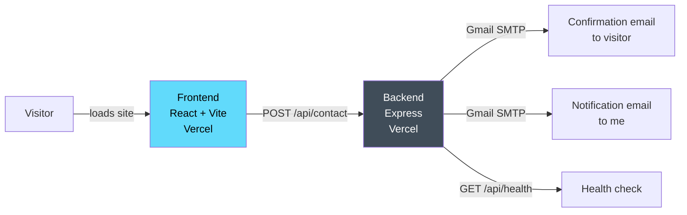

# 🌐 Personal Portfolio Website

[](https://react.dev/)
[](https://www.typescriptlang.org/)
[](https://expressjs.com/)
[](https://vercel.com/)

Source code for my personal portfolio site
([profile-mnabil.vercel.app](https://profile-mnabil.vercel.app)) — a React
frontend with a small Express backend that handles contact-form
submissions via email, both deployed independently on Vercel.

> 📖 Full setup, deployment, and troubleshooting details are in
> **[SETUP_GUIDE.md](./SETUP_GUIDE.md)** — this README covers the
> essentials to get running quickly.

---

## Architecture



The frontend and backend are **deployed and versioned as one repo, but run
as two separate Vercel projects.** The frontend doesn't know its
backend's URL automatically — it's set manually via a flag in
`frontend/src/config/api.ts` (see [API Configuration](#api-configuration)).

---

## Project Structure

```
profile/
├── frontend/          # React app (deployed on Vercel)
│   └── src/
│       ├── config/api.ts       # Manual dev/production backend URL switch
│       └── components/
│           └── Contact.tsx      # Contact form, calls the backend
│
└── backend/           # Express server (deployed on Vercel)
    ├── index.js                 # Contact-form email handling
    ├── .env.example             # Template — never commit the real .env
    └── package.json
```

---

## Quick Start (Local Development)

### 1. Backend

```bash
cd backend
npm install
```

Copy `.env.example` to `.env` and fill in real values:

```
USER=your-email@gmail.com
PASS=your-app-specific-password   # see "Gmail Setup" below — never a real password in this file
PORT=5000
```

```bash
npm run dev
```

### 2. Frontend

```bash
cd frontend
npm install
```

In `frontend/src/config/api.ts`, set:

```ts
const ACTIVE_ENV: 'development' | 'production' = 'development'
```

```bash
npm run dev
```

Visit `http://localhost:5173` and test the contact form.

---

## Gmail Setup

The backend sends email via **Gmail SMTP** using an **App Password** (not
your regular Gmail password):

1. Enable 2-Step Verification: [myaccount.google.com/security](https://myaccount.google.com/security)
2. Generate an App Password: [myaccount.google.com/apppasswords](https://myaccount.google.com/apppasswords)
3. Put the generated 16-character password in your **local, uncommitted**
   `.env` as `PASS`

> ⚠️ **Never put a real App Password in any file that gets committed** —
> not `.env` (already gitignored), and not as an "example" value in
> documentation either. Use a placeholder like `xxxx-xxxx-xxxx-xxxx` in
> any docs or examples.

---

## API Configuration

The frontend switches backend URLs via a **manual flag** in
`frontend/src/config/api.ts` (not `.env.local` / `import.meta.env.MODE`):

```ts
const ACTIVE_ENV: 'development' | 'production' = 'production'

const API_CONFIG = {
  development: 'http://localhost:5000',
  production: 'https://profile-ihp3.vercel.app'
}
```

To point at a different backend deployment, edit `API_CONFIG.production`
directly and commit — there's no separate env file for this.

---

## API Endpoints

| Method | Path | Description |
|---|---|---|
| POST | `/api/contact` | Submit the contact form — sends a confirmation email to the visitor and a notification email to me |
| GET | `/api/health` | Health check — returns `{ "status": "ok" }` |

**Request body for `/api/contact`:**
```json
{ "name": "John Doe", "email": "john@example.com", "message": "Hello!" }
```

---

## Deployment

Both `frontend/` and `backend/` deploy independently to Vercel (connect
the GitHub repo, set the project root to each folder respectively).

**Backend environment variables** (Vercel dashboard → Settings →
Environment Variables):
```
USER=your-email@gmail.com
PASS=your-app-specific-password
PORT=5000
FRONTEND_URL=https://your-frontend-domain.vercel.app
```

Full deployment and troubleshooting steps: **[SETUP_GUIDE.md](./SETUP_GUIDE.md)**

---

## Features

- ✅ Dynamic environment configuration (manual dev/production switch)
- ✅ Contact form with confirmation + admin notification emails
- ✅ CORS configured for both local and production frontend origins
- ✅ Client-side form validation and loading states

---

## Security Notes

- `.env` is gitignored — never commit real credentials
- Use `.env.example` as the template for required variables
- Gmail App Passwords are safer than the account password, but still
  **secrets** — treat them like any other credential, including never
  pasting a real one into documentation as an "example"
